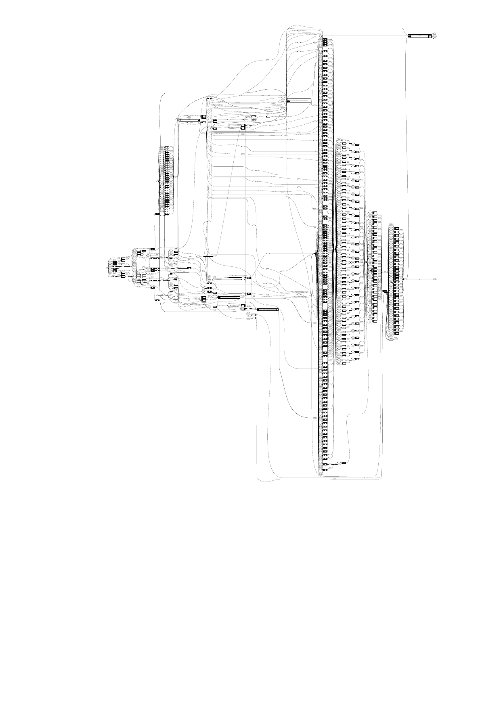

# Parameterized SystemVerilog ALU

A modular **parameterized Arithmetic Logic Unit (ALU)** written in SystemVerilog.  
The design demonstrates professional RTL practices including modular datapath architecture, hierarchical carry-lookahead addition, and full verification.

---

# Features

• Fully **parameterized datapath width** (default: 32 bits)

• **Hierarchical Carry Lookahead Adder (CLA)** implementation

• Modular ALU datapath architecture

• Saturation arithmetic support

• Status flag generation

• Self-checking verification testbench

• Yosys synthesis analysis

---

# Supported Operations

| Opcode | Operation |
|--------|-----------|
|  0000  |    ADD    |
|  0001  |    SUB    |
|  0010  |    AND    |
|  0011  |    OR     |
|  0100  |    XOR    |
|  0101  |    XNOR   |
|  0110  |    SLL    |
|  0111  |    SRL    |
|  1000  |    SRA    |
|  1001  |    SLT    |
|  1010  |    SLTU   |
|  1011  |    MIN    |
|  1100  |    MAX    |

---

# Architecture

The ALU is composed of modular functional units.

Major blocks:

• CLA Adder 
• Logic Unit 
• Shift Unit 
• Compare Uni 
• Flag Unit

---

# Simulation

Run simulation with Icarus Verilog:

iverilog -g2012 src/*.sv tb/tb_alu.sv -o alu_test
vvp alu_test

Waveforms can be viewed using GTKWave:

gtkwave wave.vcd

---

# Synthesis

Run Yosys synthesis:

yosys scripts/synth_alu.ys

This generates the synthesized datapath and statistics for the ALU design.

---

# Tools Used

• SystemVerilog 
• Icarus Verilog 
• GTKWave 
• Yosys 

---

# Author

Shyam
